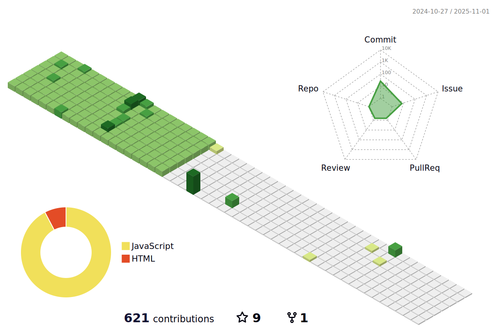

  
  

    
    
    
    
    
    
    
    
    
    
    

  🔭 I’m currently working on IoV  
  🌱 I’m currently learning Computer Vision and Game Engine Development 
  📫 You can contact me via email: yangjiening.mail@bupt.edu.cn 

